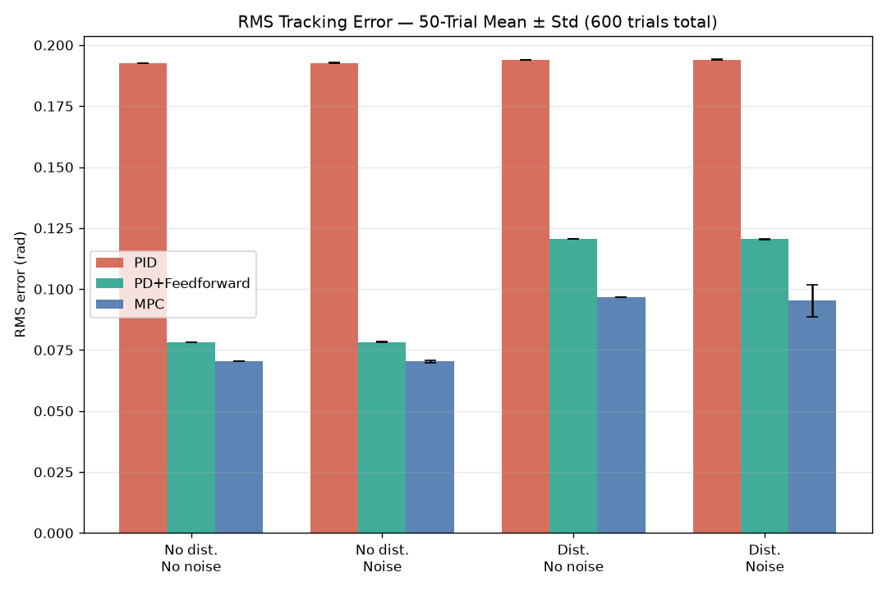
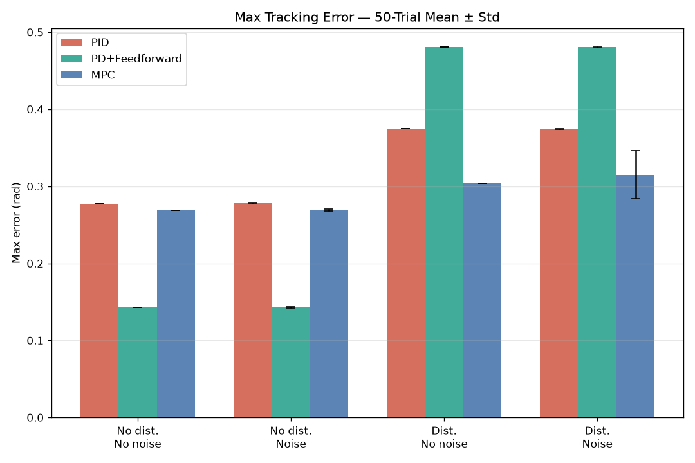
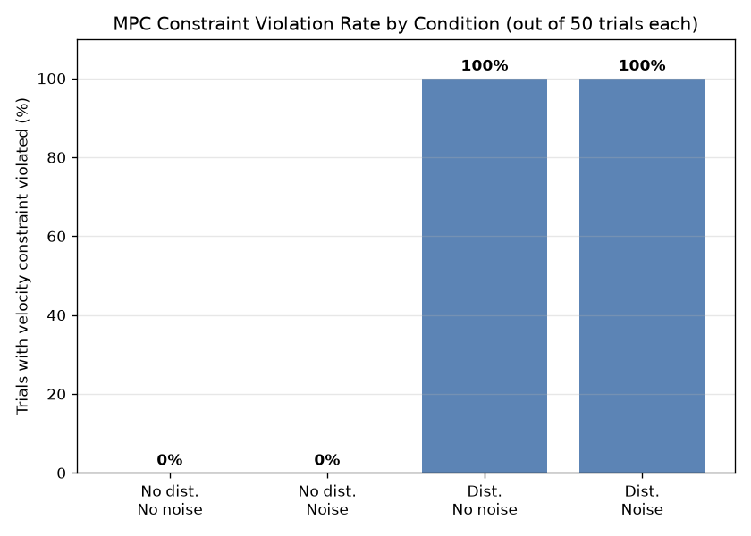

# ControlLoop-RT

**Model-Predictive Control, Feedforward & Real-Time Safety-Critical Systems**

A controls engineering system built from first principles: classical
feedback control, feedforward, constrained MPC, a real-time embedded
port, and functional-safety mechanisms — validated end-to-end on the
same simulated DC servo plant, with every claim backed by measured data.

---

## Contents

- [What This Demonstrates](#what-this-demonstrates)
- [Architecture](#architecture)
- [Key Results](#key-results)
- [Repository Structure](#repository-structure)
- [Getting Started](#getting-started)
- [Documentation](#documentation)
- [Path to Production](#path-to-production)
- [License](#license)

---

## What This Demonstrates

| Area | What Was Built | Headline Result |
|---|---|---|
| Classical control | PID → diagnosed instability → PD via pole placement | 6.06% overshoot, 0.447s settling, zero steady-state error |
| Feedforward | Model-inversion feedforward on top of PD | 87.4% RMS tracking error reduction on a moving reference |
| Model Predictive Control | Constrained QP, receding horizon (do-mpc/CasADi) | 14× lower control chatter than PD under sensor noise |
| Real-time embedded | Ported into a genuine Zephyr RTOS task | Proven real preemption; zero jitter under stress test |
| Functional safety | Watchdog, dual-sensor voting, active-hold safe-state | Reduced uncontrolled coast distance from 0.48 rad → 0.0000 rad |
| Rigorous benchmarking | 600 trials: 3 controllers × 4 conditions × 50 trials | No single controller wins — a real, quantified tradeoff |

Every stage found and fixed at least one genuine bug or design flaw
during development — see [DEVLOG.md](DEVLOG.md) for the full, honest
debugging history, not a cleaned-up highlight reel.

---

## Architecture

    ┌─────────────────────────────────────────────────────────────┐
    │  Stage 1 — Plant & Baseline                                  │
    │  DC Servo (2nd-order ODE) → State-Space → PD → Feedforward   │
    └───────────────────────────┬───────────────────────────────────┘
                                 │
    ┌───────────────────────────▼───────────────────────────────────┐
    │  Stage 2 — Model Predictive Control                          │
    │  do-mpc/CasADi QP (N=20, 50Hz) → constraints → stress-tested  │
    └───────────────────────────┬───────────────────────────────────┘
                                 │
    ┌───────────────────────────▼───────────────────────────────────┐
    │  Stage 3 — Real-Time Integration (Zephyr RTOS)                │
    │  1kHz periodic task → preemption proven → zero-jitter proven  │
    └───────────────────────────┬───────────────────────────────────┘
                                 │
    ┌───────────────────────────▼───────────────────────────────────┐
    │  Stage 4 — Functional Safety                                 │
    │  Watchdog → Sensor Voting → Active-Hold → ISO 26262 mapping   │
    └───────────────────────────┬───────────────────────────────────┘
                                 │
    ┌───────────────────────────▼───────────────────────────────────┐
    │  Stage 5 — Benchmarking                                       │
    │  600 trials → RMS/max error, chatter, settling, constraints   │
    └─────────────────────────────────────────────────────────────┘

---

## Key Results

### Tracking Error Across Controllers and Conditions

MPC has the best average tracking; PD+Feedforward is close behind under
normal conditions. See below for why this isn't the whole story.

### Feedforward's Hidden Fragility

Feedforward has the *best baseline* performance but is by far the *most
fragile* under an unmodeled disturbance (+236% peak error vs. PID's
+35% and MPC's +13%) — because feedforward has no adaptive mechanism to
correct for anything it doesn't already know about.

### MPC's Constraint Guarantee Is Conditional

MPC's velocity constraint holds perfectly (0% violated) under normal
operation — but breaks down deterministically (100% violated) the
moment a real, unmodeled disturbance hits. This is a textbook property
of *nominal* MPC, not a bug — see [the math reference doc](docs/notes/controls_math_reference.md)
for the full explanation and what "robust MPC" would add.

**Full results table:** [stage5_benchmarking/RESULTS_TABLE.md](stage5_benchmarking/RESULTS_TABLE.md)

---

## Repository Structure

| Path | Contents | Language |
|---|---|---|
| `stage1_plant/` | Plant model, PD baseline, feedforward | Python |
| `stage2_mpc/` | MPC formulation, constraints, horizon tuning, stress tests | Python |
| `stage3_rtos/` | Real-time Zephyr port: periodic task, preemption, jitter | C |
| `stage4_safety/` | Watchdog, sensor voting, active-hold safe-state | C |
| `stage5_benchmarking/` | Test protocol, 600-trial runner, plots, results table | Python |
| `docs/notes/` | Math reference, ISO 26262 mapping, plant derivation | Markdown |
| `assets/` | Benchmark comparison plots (embedded above) | — |
| `DEVLOG.md` | Full running development log — every bug, every fix | Markdown |
| `requirements.txt` | Python dependencies (Stages 1, 2, 5) | — |

---

## Getting Started

### Python environment (Stages 1, 2, 5)

    python3 -m venv venv
    source venv/bin/activate
    pip install -r requirements.txt

    python3 stage1_plant/dc_servo_model.py
    python3 stage5_benchmarking/run_full_suite.py   # full 600-trial suite, ~16 min

### Zephyr RTOS environment (Stages 3, 4)

Requires a working Zephyr SDK + west workspace. See
[DEVLOG.md, Stage 3 Task 9](DEVLOG.md) for the exact `west build -s/-d`
pattern used to build an out-of-tree app against a shared workspace.

    west build -s stage3_rtos/control_loop_rt -d stage3_rtos/build -b native_sim --pristine
    ./stage3_rtos/build/zephyr/zephyr.exe

---

## Documentation

| Document | What's Inside |
|---|---|
| [`docs/notes/controls_math_reference.md`](docs/notes/controls_math_reference.md) | Every formula used, fully derived, with worked numeric examples using this project's real numbers |
| [`docs/notes/plant_model_and_baseline.md`](docs/notes/plant_model_and_baseline.md) | Plant derivation and Stage 1 baseline results |
| [`docs/notes/iso26262_functional_safety_mapping.md`](docs/notes/iso26262_functional_safety_mapping.md) | Documented (not certified) ISO 26262 mapping — hazard analysis, safety goals, full traceability table |
| [`DEVLOG.md`](DEVLOG.md) | Complete development history — every bug found, diagnosed, and fixed, with root causes |
| [`stage5_benchmarking/TEST_PROTOCOL.md`](stage5_benchmarking/TEST_PROTOCOL.md) | Full benchmark protocol, including two real design issues caught before the full run |

---

## Path to Production

This is a learning and demonstration project, not a certified
safety-critical system. What would genuinely need to change:

| This Project | Production Would Require |
|---|---|
| Python (do-mpc/CasADi) | Simulink/MATLAB or a certified modeling environment |
| Zephyr `native_sim` | VxWorks, QNX, or certified AUTOSAR RTOS on real hardware |
| Self-reviewed ISO 26262 mapping | Independent safety assessment |
| No static analysis | MISRA C compliance and static analysis on all embedded C |
| Markdown traceability table | Formal requirements-traceability tooling (e.g. DOORS) |
| Solo repository | Dedicated, resourced safety review process |
| `native_sim`'s idealized clock | Real hardware — genuine jitter numbers require real silicon |

Full itemized gap list:
[`docs/notes/iso26262_functional_safety_mapping.md`](docs/notes/iso26262_functional_safety_mapping.md)

---

## License

MIT — see [LICENSE](LICENSE).

**GitHub:** [github.com/Asif-Ucchwas/controlloop-rt](https://github.com/Asif-Ucchwas/controlloop-rt)
